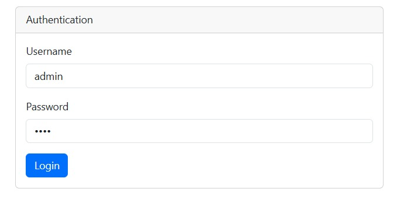
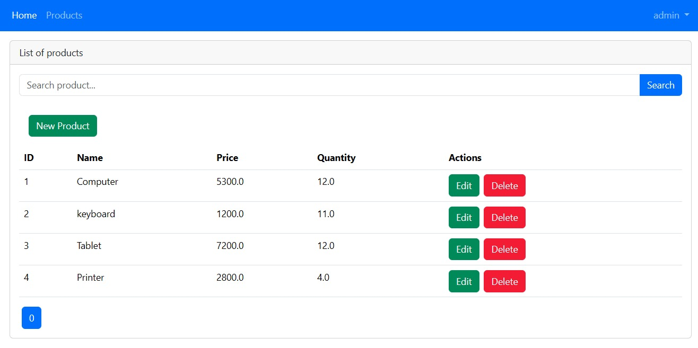

# Gestion des Produits 

Réalisé par : Majri Salma

Encadré par : M. Youssfi Mohammed

Filière : SDIA-1

Module : Programmation distribuees et Middlewares

---

## Objectif du Projet
Créer une application Web JEE complète permettant la gestion d'un catalogue de produits, en respectant l'architecture **MVC** (Model-View-Controller) et en assurant la persistance et la sécurité des données.

---

### Authentification
Sécurisation de l'accès via une page de connexion personnalisée avec Spring Security.

### Catalogue de Produits
Affichage dynamique avec recherche par mot-clé et pagination.

---

##  Stack Technique
* **Backend :** Spring Boot 3, Spring Data JPA, Hibernate.
* **Frontend :** Thymeleaf, Bootstrap 5, Thymeleaf Layout Dialect.
* **Sécurité :** Spring Security (Authentification In-Memory).
* **Base de données :** H2 Database (Mode In-Memory).
* **Outils :** Maven, Lombok, Spring Validation.

---

## ️ Configuration & Test
* **Port de l'application :** `8094`
* **URL de l'index :** `http://localhost:8094/user/index`
* **Console H2 :** `http://localhost:8094/h2-console` (JDBC URL: `jdbc:h2:mem:products-db`)
* **Identifiants de Test :**
    * **Admin :** `admin` / `1234` (Accès total)
    * **User :** `salma` / `1234` (Consultation uniquement)

---

> Projet réalisé dans le cadre du TP Spring MVC.